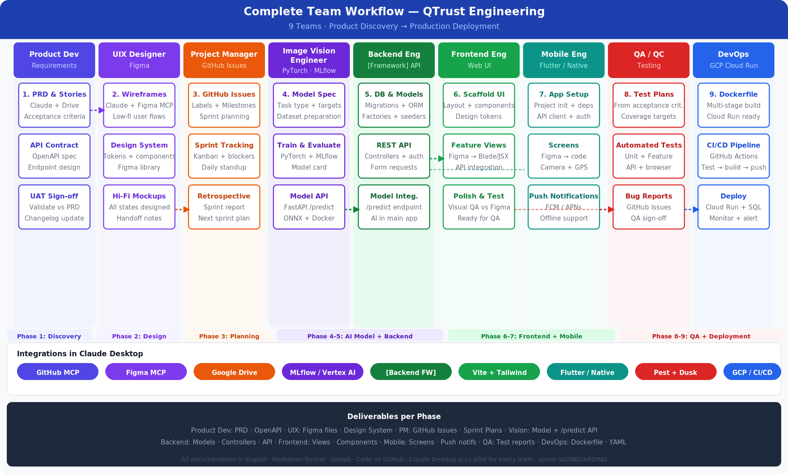

# QTrust Engineering — Onboarding Repository

> **Organisation:** QTrust (PT Langgeng Sukses Abadi Tekhnologi)  
> **Maintained by:** Engineering Team  
> **Version:** 1.0 — June 2026

This repository contains the standard onboarding documentation for all QTrust engineering teams. Every new project starts here — the guides are project-agnostic templates that work for any tech stack, any cloud provider, and any subset of teams.

---

## 🗺 Complete Team Workflow



> 9 teams · 9 phases · from Product Discovery to Production Deployment.  
> Source file: [`assets/qtrust-team-workflow.svg`](assets/qtrust-team-workflow.svg)

### 🔗 Live process-flow diagrams (FigJam)

Interactive, editable versions of the end-to-end workflow — synthesised from this repository. Open in FigJam to explore, comment, or adapt:

| Diagram | Best for | Link |
|---|---|---|
| **End-to-end flow** | The full sequence + handoffs + environment gates at a glance | [Open in FigJam](https://www.figma.com/board/2tZ2DdRIrsbVxj42xTbKzE) |
| **Swimlane by team** | Seeing exactly what each of the 9 teams owns and hands off | [Open in FigJam](https://www.figma.com/board/1D5I6WZoI2dPm8ibeEAiFX) |
| **Detailed by phase** | The concrete steps, artifacts, and gates inside each phase | [Open in FigJam](https://www.figma.com/board/b4wAh7jsmFpFZxBnPNoK1R) |

---

## 🚀 Starting a New Project?

**Read this first:** [`new-project-setup-guide.md`](new-project-setup-guide.md)

It covers the complete 8-step setup process — from completing the Project Configuration Sheet to running the project kickoff — for IT Heads and Product Heads.

**How code ships:** [`environments-and-promotion.md`](environments-and-promotion.md) — the canonical Local → Staging → Production workflow every team follows, including the branch ↔ environment mapping and the promotion gates.

**For leadership:** [`executive-business-layer.md`](executive-business-layer.md) — how the engineering workflow rolls up into business outcomes for the CEO and top management, plus the [`Monthly Business Review template`](templates/monthly-business-review-template.md).

---

## 📋 Team Onboarding Guides

Each guide is a self-contained onboarding document for a specific team role. Share the relevant guide with each new team member on Day 1.

| # | Team | Guide | Key Tools |
|---|---|---|---|
| 1 | Product Development | [`teams/product-development.md`](teams/product-development.md) | Claude Desktop · GitHub · Google Drive |
| 2 | UIX Designer | [`teams/uix-designer.md`](teams/uix-designer.md) | Figma · Claude + Figma MCP |
| 3 | Project Manager | [`teams/project-manager.md`](teams/project-manager.md) | GitHub Issues · Milestones · Kanban |
| 4 | Frontend Engineer | [`teams/frontend-engineer.md`](teams/frontend-engineer.md) | [Framework] · Vite · Tailwind |
| 5 | Backend Engineer | [`teams/backend-engineer.md`](teams/backend-engineer.md) | [Framework] · PostgreSQL · Redis |
| 6 | Image Vision Engineer | [`teams/image-vision-engineer.md`](teams/image-vision-engineer.md) | PyTorch · MLflow · FastAPI |
| 7 | QA / QC | [`teams/qa-qc.md`](teams/qa-qc.md) | Pest PHP · Postman · GitHub Issues |
| 8 | DevOps | [`teams/devops.md`](teams/devops.md) | Docker · GCP/AWS/Azure · GitHub Actions |
| 9 | Mobile Apps Engineer | [`teams/mobile-engineer.md`](teams/mobile-engineer.md) | Flutter · Android Studio · Xcode |

---

## 📁 Templates

Ready-to-use templates for common project documents.

| Template | Purpose |
|---|---|
| [`templates/project-config-sheet.md`](templates/project-config-sheet.md) | Fill this out when starting any new project — defines the stack, team, and timeline |
| [`templates/prd-template.md`](templates/prd-template.md) | Product Requirements Document template for any module or feature |
| [`templates/cowork-instructions.md`](templates/cowork-instructions.md) | Claude Cowork project instructions template — paste into Project Settings |
| [`templates/monthly-business-review-template.md`](templates/monthly-business-review-template.md) | Monthly Business Review brief for the CEO / top management — the strategic-layer output |

---

## 🛠 Tool Setup Guides

Every team member works inside Claude Desktop with MCP integrations that connect directly to your tools. See the complete setup guide:

**[`tools/README.md`](tools/README.md)** — Tool matrix, who needs what, setup order, and per-role checklists.

| Tool | Purpose | Guide |
|---|---|---|
| Claude Desktop | AI co-pilot + MCP hub | [`tools/claude-desktop.md`](tools/claude-desktop.md) |
| GitHub | Code, issues, CI/CD | [`tools/github.md`](tools/github.md) |
| Google Drive | Shared documentation | [`tools/google-drive.md`](tools/google-drive.md) |
| Google Calendar | Sprint ceremonies + meeting scheduling | [`tools/google-calendar.md`](tools/google-calendar.md) |
| Slack | Team communication + alerts | [`tools/slack.md`](tools/slack.md) |
| Figma | UI/UX design | [`tools/figma.md`](tools/figma.md) |
| Fireflies | Meeting transcripts | [`tools/fireflies.md`](tools/fireflies.md) |
| Linear | Sprint management + roadmap | [`tools/linear.md`](tools/linear.md) |
| Sentry | Production error tracking | [`tools/sentry.md`](tools/sentry.md) |
| Datadog | Infrastructure & APM monitoring | [`tools/datadog.md`](tools/datadog.md) |

> **Day 1 minimum for everyone:** Claude Desktop → Google Drive → GitHub → Slack. Then add role-specific tools per the matrix in `tools/README.md`.

---

## 🔄 Complete Team Workflow

All 9 teams work in sequence across 9 phases:

```
Phase 1: Discovery      → Product Development + Project Manager
Phase 2: Design         → UIX Designer
Phase 3: Sprint Planning → Project Manager + all teams
Phase 4: AI Model Dev   → Image Vision Engineer → Backend (model API)
Phase 5: Backend Dev    → Backend Engineer
Phase 6: Frontend Dev   → Frontend Engineer
Phase 7: Mobile Dev     → Mobile Apps Engineer
Phase 8: QA & Testing   → QA / QC (all teams support)
Phase 9: Deployment     → DevOps (all teams support)
```

Key handoffs:
- **PRD approved** → UIX Designer + PM receive it
- **Mockups approved** → Frontend + Mobile receive them
- **Model `/predict` API ready** → Backend integrates it
- **REST API complete** → Frontend + Mobile integrate it
- **QA sign-off** → DevOps deploys to production

---

## 📌 How to Use This Repository

### For IT Head / Product Head
1. Read [`new-project-setup-guide.md`](new-project-setup-guide.md) end-to-end
2. Complete [`templates/project-config-sheet.md`](templates/project-config-sheet.md) for your new project
3. Copy the Cowork project instructions from [`templates/cowork-instructions.md`](templates/cowork-instructions.md)
4. Distribute the relevant team guides from `teams/` to each team member

### For Team Members
1. Receive your team guide from the IT Head or PM on Day 1
2. Read the **Project Configuration Sheet** for your specific project (stored in Google Drive)
3. Complete the **First Week Checklist** at the end of your guide
4. Use Claude Desktop as your co-pilot throughout the project

### For Project Managers
1. Use [`templates/prd-template.md`](templates/prd-template.md) to request PRDs from Product Development
2. Follow the GitHub setup instructions in [`teams/project-manager.md`](teams/project-manager.md)
3. Distribute onboarding guides as described in [`new-project-setup-guide.md`](new-project-setup-guide.md) — Step 7

---

## 🛠 Core Principles

| Principle | Description |
|---|---|
| **Process is consistent** | Every project follows the same 8 setup steps |
| **Technology is flexible** | Stack, cloud provider, and team composition are chosen per project |
| **Claude as co-pilot** | Every team member uses Claude Desktop with a premium QTrust account |
| **Docs in Markdown** | All documentation in GitHub-flavored Markdown, pushed to GitHub |
| **English throughout** | All documents, code comments, and commit messages in English |
| **Secrets never in code** | Use the cloud provider's secrets manager for all credentials |

---

## 📂 Repository Structure

```
ONBOARDING/
├── README.md                          ← You are here
├── new-project-setup-guide.md         ← Start here for new projects
├── environments-and-promotion.md      ← Local → Staging → Production workflow (all teams)
├── executive-business-layer.md        ← Business-outcome layer for CEO / top management
├── assets/
│   ├── qtrust-team-workflow.png       ← Workflow diagram (1856×1120 px)
│   └── qtrust-team-workflow.svg       ← Workflow diagram source (vector)
├── teams/
│   ├── product-development.md
│   ├── uix-designer.md
│   ├── project-manager.md
│   ├── frontend-engineer.md
│   ├── backend-engineer.md
│   ├── image-vision-engineer.md
│   ├── qa-qc.md
│   ├── devops.md
│   └── mobile-engineer.md
└── templates/
    ├── project-config-sheet.md
    ├── prd-template.md
    ├── cowork-instructions.md
    └── monthly-business-review-template.md
```

---

## ✏️ Contributing / Updating

These guides are living documents. When a process changes, a new tool is adopted, or a new team is added:

1. Create a branch: `docs/update-[team-or-section]`
2. Edit the relevant `.md` file
3. Open a PR with a clear description of what changed and why
4. Get approval from the IT Head or Engineering Lead
5. Merge to `main`

---

*QTrust (PT Langgeng Sukses Abadi Tekhnologi) · https://github.com/qtrust-id/ONBOARDING*
